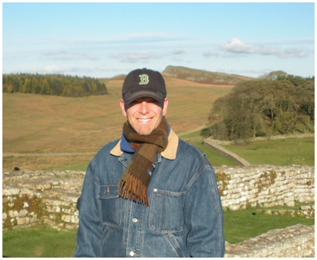

    

<<<<<<< HEAD
<h2 style="text-align: center;">Paul Barford</h2>
=======
* [Paul Barford](https://pages.cs.wisc.edu/~pb/) (Professor at the University of Wisconsin-Madison)
* [Mark Crovella](https://www.cs.bu.edu/fac/crovella/) (Professor at the Boston University)
* [Joel Sommers](https://cs.colgate.edu/~jsommers/) (Professor at the Colgate University)
* Calvin Kranig (PhD Student at the University of Wisconsin-Madison)
* Wei-Shiang Wung (PhD Student at the University of Wisconsin-Madison)

<!-- This is the base Jekyll theme. You can find out more info about customizing your Jekyll theme, as well as basic Jekyll usage documentation at [jekyllrb.com](https://jekyllrb.com/)
>>>>>>> 6b0d5609d127e1194c6e1f02b63d70cbac94205d

About TODO

<<<<<<< HEAD

    

=======
You can find the source code for Jekyll at GitHub:
[jekyll][jekyll-organization] /
[jekyll](https://github.com/jekyll/jekyll) -->
>>>>>>> 6b0d5609d127e1194c6e1f02b63d70cbac94205d

<h2 style="text-align: center;">Joel Summers</h2>

About TODO

    

<h2 style="text-align: center;">Mark Crovella</h2>

About TODO

    

<h2 style="text-align: center;">Wei-Shiang Wung</h2>

About TODO

    

<h2 style="text-align: center;">Calvin Kranig</h2>

About TODO